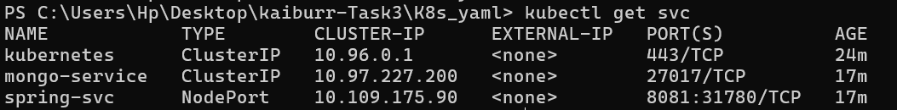

# Task 3. Kubernetes

## MongoDB
### Build MongoDB Image
To build the MongoDB Docker image:

```
cd mongo
docker build -t mongo-server .
docker run -d -p 27017:27017 --name mongo-server mongo
```

## Spring Boot
### Build Spring Boot Application

Before building the Docker image for the Spring Boot application, generate the JAR file: `mvn clean install`

### Build Docker Image
To build the Docker image for the Spring Boot application (using Distroless image):

```
docker build -t springboot-backend .
```
Run and Link Containers
Run both MongoDB and Spring Boot containers and link them:

```
docker run -p 8081:8081 --name spring-app --link mongo-server:mongo -d springboot-backend
```

## Kubernetes

### Start Minikube
Start Minikube with the required resources:
```
minikube start
```

### Creating Pods
Navigate to the `k8s_yml` directory and create pods using the provided YML files:

```
cd k8s_yml
kubectl apply -f "mongo-app.yaml"
kubectl apply -f "spring-app.yaml"
```


### Services



### Persistent Volume Claim


### Verify Deployment
Ensure the Spring Boot deployment is successful: `kubectl describe pods`


### Access Deployed Service
To access the deployed Spring Boot service, run the following command:
```
minikube service spring-svc
```


This command will open the service in your default web browser, allowing you to interact with it through the Minikube cluster.


